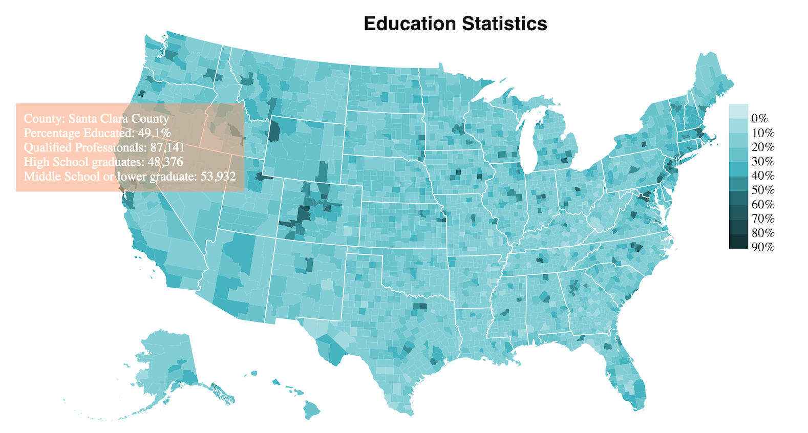

Small d3.js works I have done in fall 2018

1. graph.html: visualize relationships in node graph
2. interactive.html: interactive bar charts with linear graphs
3. Education Statistics ([data source](https://data.ers.usda.gov/reports.aspx?ID=17829))

To visualize on local, run in terminal
```
 python3 -m http.server

 #or

 python -m SimpleHTTPServer # for python2
 ```
Go to http://0.0.0.0:8000/education_us.html in browser


